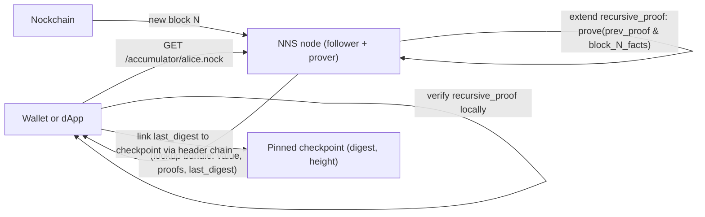

## What you picked and why it matters

The choice is **Path Y: NNS as a recursive zkRollup over Nockchain**. Concretely:

- Wallets verify a **single STARK** client-side with **no chain access** (a pinned checkpoint replaces it).
- Ownership is exclusive: the STARK attests to the entire chain scan, so "alice.nock → alice-addr" means "no earlier block contained a claim for alice.nock."
- The NNS node **keeps a follower**, but its output is a succinct proof, not a `names` map. The follower's job becomes "extend the recursive proof by one block."

This collapses what today is (kernel `names` map + `%claim` replay + Phase 7 freshness) into a single recursive proof with membership queries.

## Target architecture



Kernel state, fully reduced:

```hoon
+$  versioned-state
  $:  accumulator=nns-accumulator       :: z-set: name -> (owner tx-hash height digest)
      last-proved-height=@ud             :: Nockchain height covered by recursive proof
      last-proved-digest=@ux             :: block digest at that height
      recursive-proof=@                  :: Vesl STARK
      vesl=vesl-state                    :: retained for prover boot
  ==
```

Per-block update (Y3 steady state):

```
new_acc    = claim-scanner(acc, page_h, raw_txs_h, block_proof_h)
new_proof  = prove(
  subject = [recursive-step-formula, prev_proof, acc, new_acc, page_h, block_proof_h, parent_digest],
  formula = recursive-step-formula
)

where recursive-step-formula asserts:
  verify:vesl-stark-verifier(prev_proof)
  verify:sp-verifier(block_proof_h)
  block-commitment(page_h) == block_proof_h.commitment
  page_h.parent == last-proved-digest
  claim-scanner(acc, page_h, raw_txs_h) == new_acc
```

Wallet verifies:

```
verify:vesl-stark-verifier(recursive_proof)     :: ~615ms
z-in-inclusion(name, accumulator_root)          :: ~11 hashes
link(last_proved_digest -> checkpoint, headers) :: linear in depth
```

Total: one Vesl verify, one z-in walk, one hash chain. No chain RPC.

## Hard dependencies (currently blocking)

1. **Nock 9/10/11 in `fock:fink:interpret`.** `claim-scanner` needs to call Hoon gates (nock 9) and edit cores (nock 10). Already filed upstream ([`ARCHITECTURE.md`](ARCHITECTURE.md) §14); unchanged.
2. **Recursive STARK composition.** The recursive step calls `verify:vesl-stark-verifier` on `prev_proof` inside a formula being proved. Today's `prove-computation:vp` in [`hoon/app/app.hoon`](hoon/app/app.hoon) proves arbitrary `[subject formula]`, but we don't know if Vesl supports self-verifying proofs at reasonable cost. **Y0 is a spike to find out.**
3. **`verify:sp-verifier` inside a STARK.** Already required for Path Y; depends on (1).
4. **Narrow `tx-witness.hoon` commitment helpers.** `claim-scanner` should bind to Nockchain commitments and tx membership, not re-execute transactions. Add raw-tx hashing only if the recursive proof needs to prove a supplied raw tx matches its tx-id. Already on the NNS backlog ([`ARCHITECTURE.md`](ARCHITECTURE.md) §9.3).

Of these, (2) is the new one. It's the critical risk — if Vesl can't prove self-verification efficiently, Path Y is infeasible and we'd have to retreat to Path X or Path Z.

## Phased migration

### Claim notes — Phase 2d not pursued

An older sketch added **optional `NoteData` keys** (raw-tx, page, block-proof, header-chain) so wallets could attach chain evidence beside the packed **`blob`**. That direction is **rejected**: anything in note-data is **forgeable** off-chain; the hull must **not** treat those attachments as authoritative.

**Actual boundary:** on-chain outputs carry the canonical **`blob`** note-data entry encoding the claim triple `[name owner tx_hash]`. The follower **re-fetches** the paying transaction and block context from Nockchain RPC and runs `claim-scanner` / predicates on that view. Wallet docs: [`docs/claim-note-wallet-support.md`](docs/claim-note-wallet-support.md); Rust decode: [`src/claim_note.rs`](src/claim_note.rs).

### Y0 — upstream research and spike
Goal: answer "is recursive STARK composition feasible in current Vesl?" before we invest in kernel rewrites.

- Write an ignored test `tests/prover.rs::y0_recursive_composition_spike`: prove a trivial formula `f`, then prove a formula `g` that includes `verify:vesl-stark-verifier(proof_f)` as a subterm. Measure cost, record blocker if it traps.
- Extend the upstream Vesl issue ([`ARCHITECTURE.md`](ARCHITECTURE.md) §14) with (a) Nock 9/10/11 ask as today, (b) composition primitive ask, (c) proof-size + prove-time budget for recursion.
- Deliverable: a one-page memo updating the trilemma section of `ARCHITECTURE.md` with empirical findings.

### Y1 — accumulator and scanner design
Goal: ship pure-Hoon data structures and predicates that are prover-trace-ready when Y0 unblocks. Works without the prover in unit tests.

- [`hoon/lib/nns-accumulator.hoon`](hoon/lib/nns-accumulator.hoon): `+$ nns-accumulator`, z-set `(map name [owner tx-hash claim-height block-digest])` with arms `insert`, `has`, `get`, `root`. Inclusion proofs via `has:z-in` walk (cheap, §8.7 in ARCHITECTURE).
- [`hoon/lib/nns-predicates.hoon`](hoon/lib/nns-predicates.hoon): add `+claim-scanner` that folds over claim claims extracted from a page, inserts each valid `nns/v1/claim` whose name is not yet in the accumulator. Reuses existing Level C-A/B predicates (`pays-sender`, `pays-amount`, `matches-treasury`, `fee-for-name`, `is-valid-name`) and membership/commitment checks. It must not re-run Nockchain tx execution.
- [`hoon/lib/tx-witness.hoon`](hoon/lib/tx-witness.hoon): narrow commitment helper library (block-commitment, tx-id set membership, optional raw-tx -> tx-id hashing if needed). Do not vendor `spends` / `outputs`; those belong to Nockchain transaction execution.
- Tests: claim-scanner on handcrafted pages; duplicate-name handling; invalid-tx skipping; accumulator monotonic growth.

### Y2 — non-recursive precursor (honest-only)
Goal: ship a working rollup shape with kernel-side linear scan instead of recursive proofs. Same API the wallet will eventually see; just without cryptographic proof of correctness. Exercises every non-prover piece.

- `+$versioned-state` shrinks to `(accumulator, last-proved-height, last-proved-digest, vesl)`. All legacy state deleted.
- Replace `%claim`, `%advance-tip`, `%set-payment-address`, `%set-primary`, `%batch-settle`, `%vesl-register`, `%graft-*` with a single `%scan-block` cause. Takes `(page, raw-txs, block-proof, parent-digest)`, validates page's parent equals `last-proved-digest`, runs `claim-scanner`, mutates state.
- Rewrite [`src/chain_follower.rs`](src/chain_follower.rs) as a block-by-block scanner. Fetch block at `last_proved_height + 1`, fetch every tx in the page, poke `%scan-block`. Delete `tick_once`, `process_once_with_position_lookup`, submission queue, pending-claims mirror.
- HTTP surface shrinks to `GET /accumulator/:name`, `GET /status`, and `GET /health`. Delete `POST /claim`, `/owner/*`, `/primary/*`, `/snapshot`, `/anchor`, admin advance, and all submission endpoints.
- Wallet still trusts the server in Y2 (no recursive proof yet). Clearly labeled as transitional in `docs/wallet-verification.md`.

### Y3 — recursive proof wrapper (unblocked by Y0)
Goal: make the accumulator cryptographically verifiable without trusting the server.

- Define the recursive-step formula as a Hoon gate that asserts the five bullet-points in the architecture sketch above.
- Genesis bootstrap: kernel ships with a hardcoded `proof_0 = prove(empty_acc, genesis_digest, height=0)`.
- Per `%scan-block`, kernel also extends `recursive_proof`. New state is `(acc, h+1, digest_{h+1}, proof_{h+1})`.
- Wallet gets the recursive proof in responses and verifies it. Server trust collapses to "did they stay caught up?" (liveness only).

### Y4 — wallet SDK
Goal: wallet verifies one bundle offline.

- **Shipped:** [`src/bin/light_verify.rs`](src/bin/light_verify.rs) reads [`PathY4LookupBundle`](src/wallet_y4.rs): (1) **`%verify-stark-explicit`** for non-empty recursive proof + subject/formula JAMs; (2) **`%verify-accumulator-snapshot`** when `value` + `accumulator_snapshot_jam_hex` (full `jam(accumulator)` from `GET /accumulator/:name?wallet_export=true`); (3) header chain to pinned `--checkpoint-*`. Deprecated `z_in_proof` rejected. No Phase 7 freshness / chain-tip flags.
- Optional follow-up: hardcoded `CheckpointConfig` in the binary (today: CLI only).
- Trust model: [`docs/wallet-verification.md`](docs/wallet-verification.md).

### Y5 — reorg and fork handling
Goal: survive chain reorgs without losing safety or requiring a full re-proof from genesis.

- Checkpoint the accumulator + recursive proof every K blocks to disk (`.nns-data/checkpoints/<height>.{acc,proof}`). K ≈ `finality_depth * 4`.
- On `%scan-block`, if Nockchain RPC returns a header that conflicts with `last_proved_digest`, detect + halt forward scan, log loudly. Wait for the reorg to clear past finality depth or manual operator action.
- On confirmed reorg past `finality_depth`, rewind state to the most recent checkpoint whose digest is still on canonical chain, then re-scan + re-prove forward.
- Tests: simulated reorg within finality (should be rejected by the scanner until finality_depth passes); reorg past finality (should trigger rewind).

### Y6 — scaling and productionization
Goal: make it actually work at production throughput.

- Benchmark per-block prove latency. If greater than Nockchain block time, NNS falls behind forever. Mitigations: parallel proving of independent blocks, GPU offload (out of scope for NNS; upstream ask), accumulator compaction.
- Address accumulator growth. A z-set keyed by name grows unbounded. Either (a) accept it and re-evaluate in N years, (b) introduce fee-based expiry ("names cost a renewal fee every K blocks"), (c) use a sparse Merkle + tombstone approach for removed names. RFC this before Y3 ships.
- If and only if the full stack is stable and the accumulator/scanner pattern generalizes, propose promoting it to a reusable Vesl library for other NockApps.

### Y7 — parameterized fee schedule (nice to have)

Goal: economics can evolve without forcing every wallet integrator to ship new pinned recursive subject/formula JAMs on each tier change.

- Replace literal tiers inside `++fee-for-name` ([`hoon/lib/nns-predicates.hoon`](hoon/lib/nns-predicates.hoon)) with lookup against a **versioned schedule** (by claim height and/or stem-length tiers), committed via genesis, periodic checkpoint, or small on-chain / bundle artifact the recursive step already trusts.
- Keep Hoon / [`src/payment.rs`](src/payment.rs) in lockstep; extend [`tests/phase3_predicates.rs`](tests/phase3_predicates.rs) for schedule edges and rescan (raises vs grandfathering).
- Expose schedule in API / `light_verify` inputs as needed so verifiers use the **same** table the prover traced.
- Optional: tie schedule updates to governance or operator-signed checkpoints; RFC before implementation.

## What disappears

- [`src/chain_follower.rs`](src/chain_follower.rs) `tick_once` + submission-queue replay. Anchor-advance logic merges into `scan_block`.
- `names=(map @t name-entry)`, `claim-count`, `primaries`, `root`, `hull`, `last-settled-claim-id`, `anchor`, `last-proved`, `payment-address` in [`hoon/app/app.hoon`](hoon/app/app.hoon). All fold into `accumulator + last_proved_*`.
- Causes: `%claim`, `%set-primary`, `%batch-settle`, `%vesl-register`, `%graft-*`, `%advance-tip`, `%set-payment-address`, `%prove-claim`, `%prove-batch`, `%validate-claim`, `%verify-stark`, `%prove-identity`, `%prove-arbitrary`, `%prove-claim-in-stark`, `%verify-chain-link`, `%verify-tx-in-page`.
- Peeks: `/owner/*`, `/primary/*`, `/claim-count`, `/snapshot`, `/payment-address`, `/pending-batch`, `/last-settled`, `/proof`. Replaced by `/accumulator/:name`.
- HTTP: `POST /claim`, `POST /settle`, `POST /admin/advance-tip-now`, `GET /proof`. Replaced by `GET /accumulator/:name`.
- Tests: most of [`tests/phase2_anchor.rs`](tests/phase2_anchor.rs), [`tests/phase7_two_servers.rs`](tests/phase7_two_servers.rs), claim-lifecycle tests in [`tests/handlers.rs`](tests/handlers.rs), Level A/B/C predicate tests that assume kernel owns a names map.

## What survives

- Chain fetchers in [`src/chain.rs`](src/chain.rs) — reused by the new follower.
- Narrow `tx-witness.hoon` vendor — same plan as ARCHITECTURE §9.3; now a hard prerequisite.
- Level C-A predicates and `+$nns-raw-tx-witness` ([`hoon/lib/nns-predicates.hoon`](hoon/lib/nns-predicates.hoon)) — reused inside `claim-scanner`.
- `fee-for-name`, `is-valid-name`, name format helpers — reused.
- `FollowerObservability` in [`src/state.rs`](src/state.rs) — reused; operator still needs to monitor "how far behind is the prover?"
- Prover boot and `vesl-state` plumbing in [`hoon/app/app.hoon`](hoon/app/app.hoon) and [`src/main.rs`](src/main.rs).

## Risks

- **Recursive composition may not be feasible in current Vesl.** If Y0 comes back negative, Path Y is blocked until upstream ships composition primitives. Retreat: Path X as interim.
- **Per-block prove cost.** Current `%prove-claim` takes ~5s on Apple Silicon ([`ARCHITECTURE.md`](ARCHITECTURE.md) §6.2). Recursive step is heavier (includes `verify:sp-verifier` + `verify:vesl-stark-verifier` inside). If prove time greatly exceeds block time, NNS is not viable on commodity hardware. Benchmark early (part of Y0).
- **Accumulator growth.** Unbounded z-set increases prove cost per block linearly (or worse). Without compaction, long-running NNS eventually stops being provable.
- **Reorg complexity.** Rewinding recursive proofs is not trivial; checkpoint cadence (Y5) directly controls recovery time.
- **Wallet-side checkpoint staleness.** If the shipped checkpoint is months old, wallets need to link many headers from `last_proved_digest` back to it. Headers are small (~40 B each) but the chain grows linearly. Mitigation: ship fresh checkpoints regularly (release cadence).
- **Operational burden.** The NNS node now needs prover hardware in production. This is the opposite direction from "stateless server anyone can run." Acceptable if the role is "NNS indexer service run by a few operators" rather than "every dApp bundles an NNS kernel."
- **Loss of partial work.** Roughly Phase 1, Phase 2 settlement, Phase 5 nns-gate, and the Level A/B/C-A bundle-proof stack get subsumed or retired. Git history preserves it; the mainline code discards without apology.

## Success criteria

- Y0: empirical answer on Vesl recursive composition, with measurements. Memo lands in `ARCHITECTURE.md`.
- Y1: `claim-scanner` + accumulator pass unit tests, with no prover involvement.
- Y2: a follower running against Nockchain testnet maintains an accumulator matching an independent scan. `GET /accumulator/:name` returns honest data.
- Y3: `light_verify` accepts a bundle returned by Y2+Y3 server, without chain access, and rejects any tampered bundle.
- Y4: wallet binary ships with a pinned checkpoint and verifies end-to-end in < 2 s offline.
- Y5: simulated reorg test passes: NNS rewinds to checkpoint, re-scans, produces a valid proof at the new tip.
- Y6: sustained operation at Nockchain mainnet block cadence on reference hardware for 24 h without falling behind.
- Y7 (optional): fee schedule updates ship without new Vesl formula pins per release; rescans remain consistent across tier changes.
